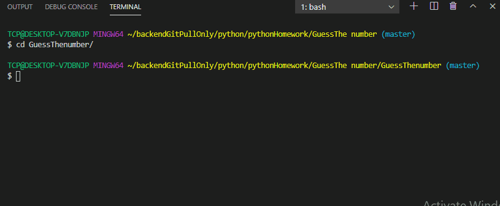

# The Guessing Game 

## Game Description 
#### The Guessing Game is an interactive game in created with `python` programming language 
---
## User Story
    As a user I want to play a guessing game created by python
    so that I can play a guessing game for fun. 

## Acceptance Criteria 
**_Given_** that the user guesses a number starts the guessing game with a random number
    
**_When_** the user guesses a number the computer will give various hints if the number is too high or too low
    
**_Then_** when user guesses the correct number the computer will print the answer along with the number of attempts by the user 

    Validate the guessing game runs in python version 3.8.4
    Validate the user has five attempts to guess the correct number
    Validate the computer will generate a random number  
---
---

